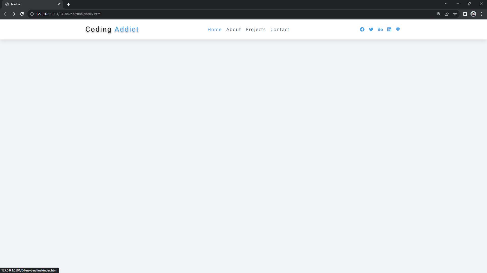

#### 138. [Navbar HTML](#138)

#### 139. [Navbar General Concepts](#139)

#### 140. [Navbar JS](#140)

---

 

### 138. Navbar HTML

> **_Business Objective: Layout_**

| Technology    | Description   |
| ------------- | ------------- |
| `Language`    | html, css, js |
| `Framework`   | -             |
| `Library`     | -             |
| `Text editor` | Vs code       |

---

 

### 139. Navbar General Concepts

 

### 140. Navbar JS

 
