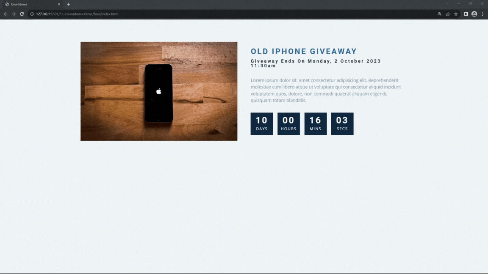

#### 174. [Countdown HTML](#174)

#### 175. [Set Date](#175)

#### 176. [Calculate Remaining Time](#176)

#### 177. [Time From Now](#177)

---

 

### 174. Countdown HTML

> **_Business Objective: Layout_**

| Technology    | Description   |
| ------------- | ------------- |
| `Language`    | html, css, js |
| `Framework`   | -             |
| `Library`     | -             |
| `Text editor` | Vs code       |

---

 

### 175. Set Date

 

### 176. Calculate Remaining Time

 

### 177. Time From Now

 
