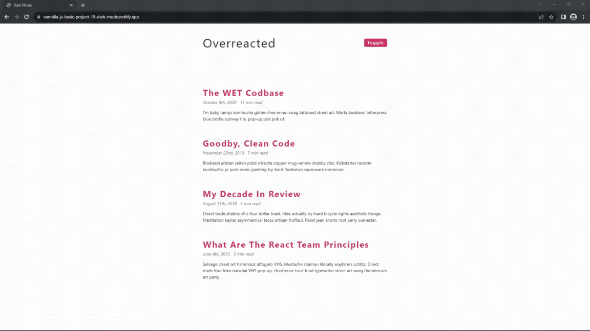

#### 286. [Dark Mode - Intro](#286)

#### 287. [Dark Mode - Setup](#287)

#### 288. [Dark Mode - HTML Structure](#288)

#### 289. [Dark Mode - Toggle CSS](#289)

#### 290. [Dark Mode - Import Data](#290)

#### 291. [Dark Mode - Render Items](#291)

#### 292. [Dark Mode - Moment.js](#292)

---

<br>

### 286. Dark Mode - Intro<a id="286"></a>

> **_Business Objective: Layout_**



| Technology    | Description   |
| ------------- | ------------- |
| `Language`    | html, css, js |
| `Framework`   | -             |
| `Library`     | moment.js     |
| `Text editor` | Vs code       |

<br>

### 287. Dark Mode - Setup<a id="287"></a>

Go to starter folder

<br>

### 288. Dark Mode - HTML Structure<a id="288"></a>

- main tags
  - nav
    - div.nav-center
      - span 'overreacted'
      - button.btn 'toggle'
  - section.articles
    - article.post
      - h2 'post title'
      - div.post-info
        - span 'date'
        - span 'read time'
      - p 'content'

---

In index.html

```html
<!DOCTYPE html>
<html lang="en">
  <head>
    <meta charset="UTF-8" />
    <meta http-equiv="X-UA-Compatible" content="IE=edge" />
    <meta name="viewport" content="width=device-width, initial-scale=1.0" />
    <title>Dark Mode</title>
    <link rel="stylesheet" href="./styles.css" />
  </head>
  <body>
    <nav>
      <div class="nav-center">
        <span>overreacted</span>
        <button class="btn">toggle</button>
      </div>
    </nav>

    <section class="articles">
      <!-- single post -->
      <article class="post">
        <h2>post title</h2>

        <div class="post-info">
          <span>date</span>
          <span>5 min read</span>
        </div>
        <p>
          Lorem ipsum dolor sit, amet consectetur adipisicing elit. Minus
          dignissimos cumque sapiente vero necessitatibus architecto.
        </p>
      </article>
      <!-- end of single post -->
    </section>

    <script src="./app.js"></script>
  </body>
</html>
```

<br>

### 289. Dark Mode - Toggle CSS<a id="289"></a>

##### Toggle - JS

- select button
- add click event listener

##### Toggle - CSS

- create .dark-theme class

##### Toggle - JS

- select root element (html), toggle .dark-theme

---

In styles.css

```css
/*
=============== 
Global Styles
===============
*/

:root {
  --clr-bcg: #fff;
  --clr-font: #282c35;
  --clr-primary: #d23669;
  --clr-grey: #64748b;
}

/* 1️⃣ dark theme configuration */
.dark-theme {
  --clr-bcg: #282c35;
  --clr-font: #fff;
  --clr-primary: #ffa7c4;
  --clr-grey: #cbd5e1;
}

*,
::after,
::before {
  margin: 0;
  padding: 0;
  box-sizing: border-box;
}
body {
  font-family: -apple-system, BlinkMacSystemFont, "Segoe UI", Roboto, Oxygen,
    Ubuntu, Cantarell, "Open Sans", "Helvetica Neue", sans-serif;
  background: var(--clr-bcg);
  color: var(--clr-font);
  line-height: 1.5;
  font-size: 0.875rem;
  transition: all 0.3s linear;
}

/*
=============== 
Navbar
===============
*/
.nav-center {
  width: 90vw;
  max-width: 600px;
  margin: 0 auto;
  display: flex;
  justify-content: space-between;
  align-items: center;
  padding: 2rem 0;
}
.nav-center span {
  font-size: 2.5rem;
  text-transform: capitalize;
  letter-spacing: 2px;
}
.btn {
  background: var(--clr-primary);
  color: var(--clr-bcg);
  padding: 0.25rem 0.5rem;
  border-radius: 5px;
  border-color: transparent;
  text-transform: capitalize;
  transition: all 0.3s linear;
  font-weight: bold;
  letter-spacing: 2px;
  cursor: pointer;
}

.articles {
  padding: 5rem 0;
  width: 90vw;
  max-width: 600px;
  margin: 0 auto;
}
.post {
  margin-bottom: 3rem;
}

.post h2 {
  color: var(--clr-primary);
  text-transform: capitalize;
  letter-spacing: 2px;
  font-size: 1.75rem;
}
.post-info {
  margin-bottom: 0.75rem;
  font-style: italic;
  color: var(--clr-grey);
}
.post-info span {
  margin-right: 0.5rem;
}
```

---

In app.js

```js
// 2️⃣ select button element
const toggleBtn = document.querySelector(".btn");

// 3️⃣ add eventListener and set dark-theme class
toggleBtn.addEventListener("click", () => {
  document.documentElement.classList.toggle("dark-theme");
});
```

- Go to local host and toggle button to see feature

<br>

### 290. Dark Mode - Import Data<a id="290"></a>

In index.html

```html
<!DOCTYPE html>
<html lang="en">
  <head>
    <meta charset="UTF-8" />
    <meta http-equiv="X-UA-Compatible" content="IE=edge" />
    <meta name="viewport" content="width=device-width, initial-scale=1.0" />
    <title>Dark Mode</title>
    <link rel="stylesheet" href="./styles.css" />
  </head>
  <body>
    <nav>
      <div class="nav-center">
        <span>overreacted</span>
        <button class="btn">toggle</button>
      </div>
    </nav>

    <section class="articles">
      <!-- single post -->
      <article class="post">
        <h2>post title</h2>

        <div class="post-info">
          <span>date</span>
          <span>5 min read</span>
        </div>
        <p>
          Lorem ipsum dolor sit, amet consectetur adipisicing elit. Minus
          dignissimos cumque sapiente vero necessitatibus architecto doloremque
          nihil sequi corrupti nemo.
        </p>
      </article>
      <!-- end of single post -->
    </section>

    <!-- 1️⃣ import data old way -->
    <script src="./data.js"></script>
    <!-- logic -->
    <script src="./app.js"></script>
  </body>
</html>
```

---

In data.js

```js
const articles = [
  {
    id: 1,
    title: "the WET Codbase",
    date: new Date(2020, 9, 4),
    length: 11,
    snippet: `I'm baby ramps kombucha gluten-free ennui swag tattooed street art. Marfa biodiesel letterpress blue bottle subway tile, pop-up pok pok of.`,
  },
  {
    id: 2,
    title: "goodby, clean code",
    date: new Date(2019, 10, 22),
    length: 5,
    snippet: `Biodiesel artisan seitan plaid sriracha copper mug venmo shabby chic. Kickstarter raclette kombucha, yr post-ironic jianbing try-hard flexitarian vaporware normcore.`,
  },
  {
    id: 3,
    title: "my decade in review",
    date: new Date(2018, 7, 11),
    length: 5,
    snippet: `Direct trade shabby chic four dollar toast, tilde actually try-hard bicycle rights aesthetic forage. Meditation keytar asymmetrical tacos artisan truffaut. Pabst jean shorts roof party scenester.`,
  },
  {
    id: 4,
    title: "what are the react team principles",
    date: new Date(2015, 5, 4),
    length: 5,
    snippet: `Selvage street art hammock affogato VHS. Mustache shaman literally wayfarers schlitz. Direct trade four loko narwhal VHS pop-up, chartreuse trust fund typewriter street art swag thundercats art party.`,
  },
];
```

---

In app.js

```js
const toggleBtn = document.querySelector(".btn");

toggleBtn.addEventListener("click", () => {
  document.documentElement.classList.toggle("dark-theme");
});

// 2️⃣ to test import data
console.log(articles);
```

<br>

### 291. Dark Mode - Render Items<a id="291"></a>

##### Display Articles

- select articles
- iterate over, return article.post for each article

---

In app.js

```js
const toggleBtn = document.querySelector(".btn");
// 1️⃣ select article
const articlesContainer = document.querySelector(".articles");

toggleBtn.addEventListener("click", () => {
  document.documentElement.classList.toggle("dark-theme");
});

// 2️⃣ render list of article
const articlesData = articles
  .map((article) => {
    const { title, date, length, snippet } = article;

    // markup
    return `<article class="post">
          <h2>${title}</h2>
          <div class="post-info">
            <span>${date}</span>
            <span>${length} min read</span>
          </div>
          <p>
            ${snippet}
          </p>
        </article>`;
  })
  .join("");

articlesContainer.innerHTML = articlesData;
```

<br>

### 292. Dark Mode - Moment.js<a id="292"></a>

##### Format Date

- import moment.js
- format date

---

- Go go google and type "cdnjs moment.js"
- copy the url script
- paste script in index.html above app.js

In index.html

```html
<!DOCTYPE html>
<html lang="en">
  <head>
    <meta charset="UTF-8" />
    <meta http-equiv="X-UA-Compatible" content="IE=edge" />
    <meta name="viewport" content="width=device-width, initial-scale=1.0" />
    <title>Dark Mode</title>
    <link rel="stylesheet" href="./styles.css" />
  </head>
  <body>
    <main>
      <nav>
        <div class="nav-center">
          <span>overreacted</span>
          <button class="btn">toggle</button>
        </div>
      </nav>
      <section class="articles">
        <!-- single post -->

        <!-- end of single post -->
      </section>
    </main>

    <!-- 1️⃣ moment.js script placement -->
    <script
      src="https://cdnjs.cloudflare.com/ajax/libs/moment.js/2.29.1/moment.min.js"
      integrity="sha512-qTXRIMyZIFb8iQcfjXWCO8+M5Tbc38Qi5WzdPOYZHIlZpzBHG3L3by84BBBOiRGiEb7KKtAOAs5qYdUiZiQNNQ=="
      crossorigin="anonymous"
      referrerpolicy="no-referrer"
    ></script>
    <!-- data -->
    <script src="./data.js"></script>
    <!-- logic -->
    <script src="./app.js"></script>
  </body>
</html>
```

---

In app.js

```js
const toggleBtn = document.querySelector(".btn");
const articlesContainer = document.querySelector(".articles");

toggleBtn.addEventListener("click", () => {
  document.documentElement.classList.toggle("dark-theme");
});

const articlesData = articles
  .map((article) => {
    const { title, date, length, snippet } = article;

    // 2️⃣ generate format date
    const formatDate = moment(date).format("MMMM Do, YYYY");
    return `<article class="post">
          <h2>${title}</h2>
          <div class="post-info">
            <span>${formatDate}</span>
            <span>${length} min read</span>
          </div>
          <p>
            ${snippet}
          </p>
        </article>`;
  })
  .join("");

articlesContainer.innerHTML = articlesData;
```

- ref. [Moment js](https://momentjs.com/) for date time format

<br>
