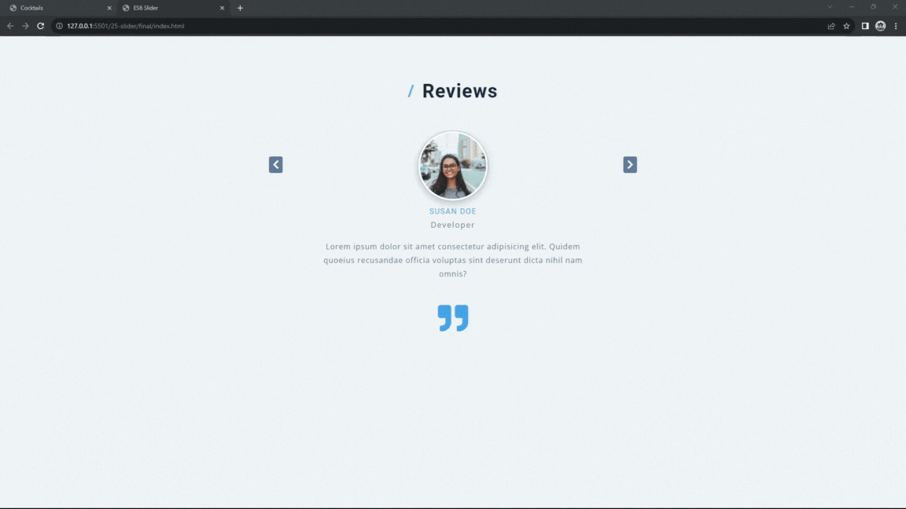

#### 372. [Intro](#372)

#### 373. [Starter Project](#373)

#### 374. [HTML Setup](#374)

#### 375. [Display People](#375)

#### 376. [Apply CSS](#376)

#### 377. [Next Slide](#377)

#### 378. [Next Slide - End of Array](#378)

#### 379. [Prev Slide](#379)

---

 

### 372. Intro

> **_Business Objective: Layout_**

| Technology    | Description   |
| ------------- | ------------- |
| `Language`    | html, css, js |
| `Framework`   | -             |
| `Library`     | -             |
| `Text editor` | Vs code       |

---

 

### 373. Starter Project

 

### 374. HTML Setup

 

### 375. Display People

 

### 376. Apply CSS

 

### 377. Next Slide

 

### 378. Next Slide - End of Array

 

### 379. Prev Slide

 
