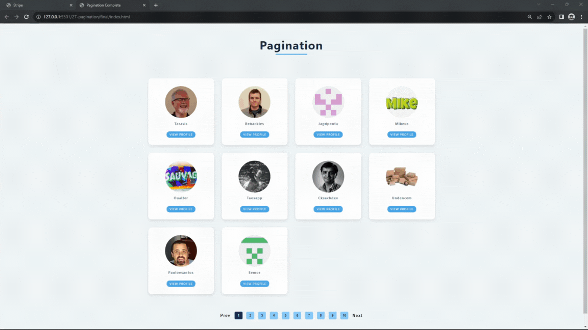

#### 388. [Intro](#388)

#### 389. [Starter Project](#389)

#### 390. [Setup](#390)

#### 391. [Fetch Followers](#391)

#### 392. [Display Followers](#392)

#### 393. [Paginate - Create Pages](#393)

#### 394. [Display Buttons](#394)

#### 395. [Button Functionality](#395)

---

 

### 388. Intro

> **_Business Objective: Layout_**

| Technology    | Description   |
| ------------- | ------------- |
| `Language`    | html, css, js |
| `Framework`   | -             |
| `Library`     | -             |
| `Text editor` | Vs code       |

---

 

### 389. Starter Project

 

### 390. Setup

 

### 391. Fetch Followers

 

### 392. Display Followers

 

### 393. Paginate - Create Pages

 

### 394. Display Buttons

 

### 395. Button Functionality

 
