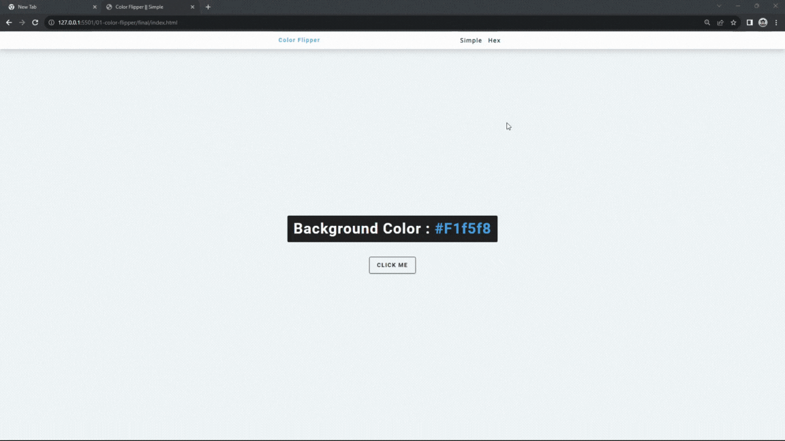

#### 131. [Color Flipper - Simple HTML](#131)

#### 132. [Color Flipper - Simple Javascript](#132)

#### 133. [Color Flipper - Hex](#133)

---

 

### 131. Color Flipper - Simple HTML

> **_Business Objective: Layout_**

| Technology    | Description   |
| ------------- | ------------- |
| `Language`    | html, css, js |
| `Framework`   | -             |
| `Library`     | -             |
| `Text editor` | Vs code       |

---

- Download the starter template
- In index.html create nav element
  - link home page hyperlink
  - link hex page hyperlink
- In index.html create main element

  - in main element, insert div element and inside it insert h2 with span, button element

- In app.js

 

### 132. Color Flipper - Simple Javascript

 

### 133. Color Flipper - Hex

 
