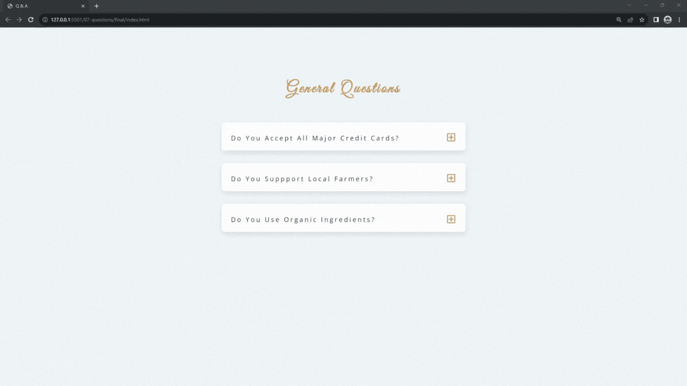

#### 147. [Questions HTML](#147)

#### 148. [Questions General Concept](#148)

#### 149. [Questions JS - Traversing the DOM](#149)

#### 150. [Questions JS - Using Selectors Inside the Element](#150)

---

 

### 147. Questions HTML

> **_Business Objective: Layout_**

| Technology    | Description   |
| ------------- | ------------- |
| `Language`    | html, css, js |
| `Framework`   | -             |
| `Library`     | -             |
| `Text editor` | Vs code       |

---

 

### 148. Questions General Concept

 

### 149. Questions JS - Traversing the DOM

 

### 150. Questions JS - Using Selectors Inside the Element

 
