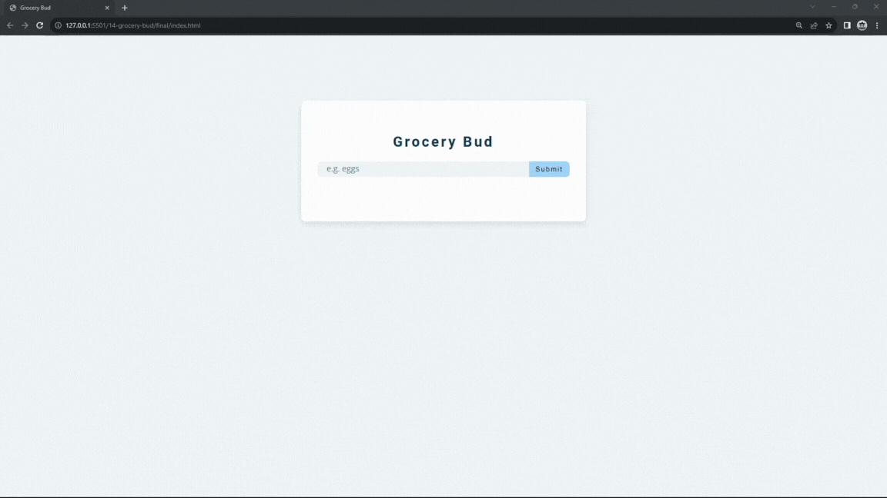

#### 180. [GroceryBud - Intro](#180)

#### 181. [GroceryBud - HTML](#181)

#### 182. [GroceryBud - Select Elements](#182)

#### 183. [GroceryBud - addItem Setup](#183)

#### 184. [GroceryBud - truthy shortcut](#184)

#### 185. [GroceryBud - display alert](#185)

#### 186. [GroceryBud - addItem](#186)

#### 187. [GroceryBud - setBackToDefault](#187)

#### 188. [GroceryBud - clear items](#188)

#### 189. [GroceryBud - select edit and delete buttons](#189)

#### 190. [GroceryBud - delete item](#190)

#### 191. [GroceryBud - edit item](#191)

#### 192. [GroceryBud - localStorage info](#192)

#### 193. [GroceryBud - addToLocalStorage](#193)

#### 194. [GroceryBud - removeFromLocalStorage](#194)

#### 195. [GroceryBud - editLocalStorage](#195)

#### 196. [GroceryBud - load items from localStorage](#196)

---

 

### 180. GroceryBud - Intro 

> **_Business Objective: Layout_**

| Technology    | Description   |
| ------------- | ------------- |
| `Language`    | html, css, js |
| `Framework`   | -             |
| `Library`     | -             |
| `Text editor` | Vs code       |

---

 

### 181. GroceryBud - HTML

 

### 182. GroceryBud - Select Elements

 

### 183. GroceryBud - addItem Setup

 

### 184. GroceryBud - truthy shortcut

 

### 185. GroceryBud - display alert

 

### 186. GroceryBud - addItem

 

### 187. GroceryBud - setBackToDefault

 

### 188. GroceryBud - clear items

 

### 189. GroceryBud - select edit and delete buttons

 

### 190. GroceryBud - delete item

 

### 191. GroceryBud - edit item

 

### 192. GroceryBud - localStorage info

 

### 193. GroceryBud - addToLocalStorage

 

### 194. GroceryBud - removeFromLocalStorage

 

### 195. GroceryBud - editLocalStorage

 

### 196. GroceryBud - load items from localStorage 

 >
