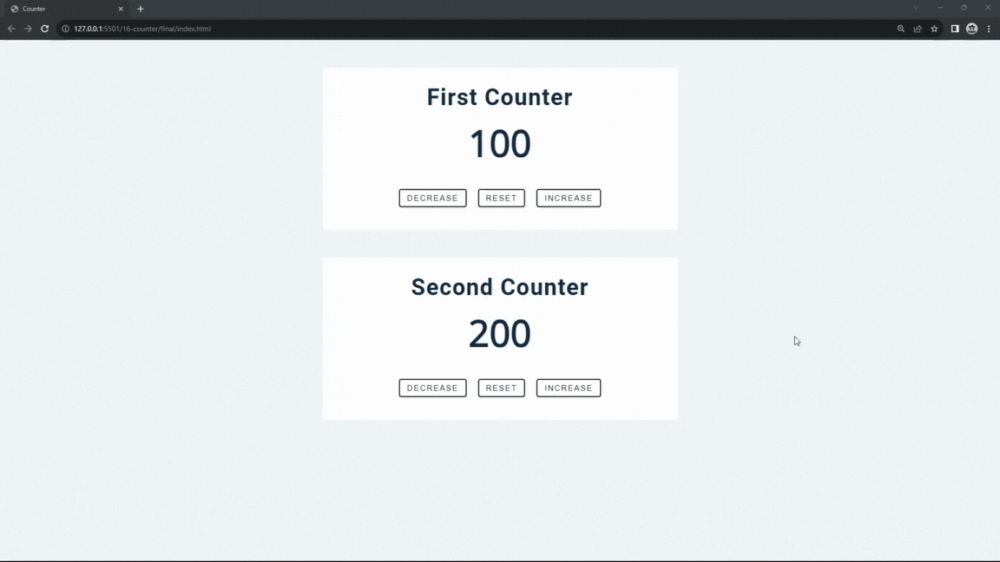

#### 221. [Intro](#221)

#### 222. [Setup](#222)

#### 223. [Counter - HTML](#223)

#### 224. [Counter Setup](#224)

#### 225. [Counter - Select Elements](#225)

#### 226. [Counter - Functions](#226)

#### 227. [Counter - Complete](#227)

#### 228. [Counter - Class Refactor](#228)

---

 

### 221. Intro

> **_Business Objective: Layout_**

| Technology    | Description      |
| ------------- | ---------------- |
| `Framework`   | -                |
| `Library`     | react hook used: |
| `Package`     | -                |
| `Text editor` | Vs code          |

---

 

### 222. Setup

 

### 223. Counter - HTML

 

### 224. Counter Setup

 

### 225. Counter - Select Elements

 

### 226. Counter - Functions

 

### 227. Counter - Complete

 

### 228. Counter - Class Refactor
