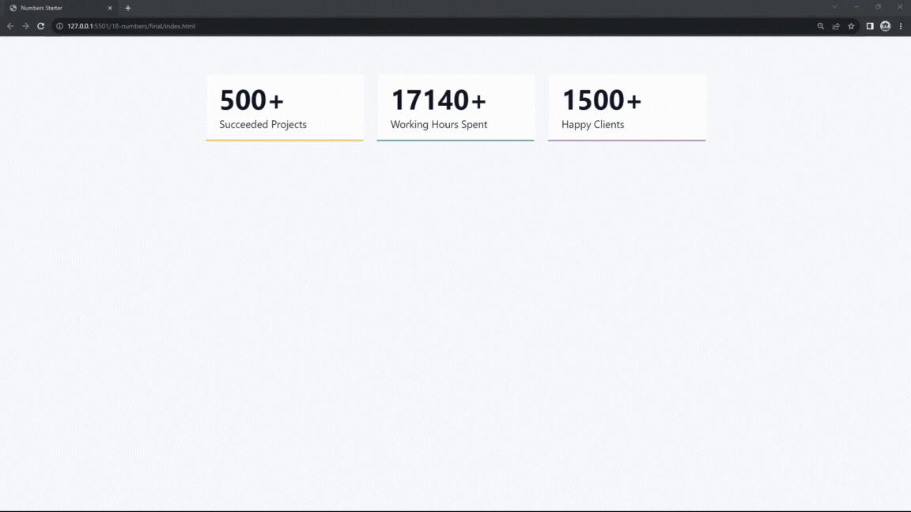

#### 278. [Projects - Intro](#278)

#### 279. [Numbers - Intro](#279)

#### 280. [Numbers - Setup](#280)

#### 281. [Readme](#281)

#### 282. [Numbers - HTML Structure](#282)

#### 283. [Numbers - Select Elements](#283)

#### 284. [Numbers - Initial Variables](#284)

#### 285. [Numbers - Complete](#285)

---

 

### 278. Projects - Intro

> **_Business Objective: Layout_**

| Technology    | Description      |
| ------------- | ---------------- |
| `Framework`   | -                |
| `Library`     | react hook used: |
| `Package`     | -                |
| `Text editor` | Vs code          |

---

 

### 279. Numbers - Intro

 

### 280. Numbers - Setup

 

### 281. Readme

 

### 282. Numbers - HTML Structure

 

### 283. Numbers - Select Elements

 

### 284. Numbers - Initial Variables

 

### 285. Numbers - Complete

 
