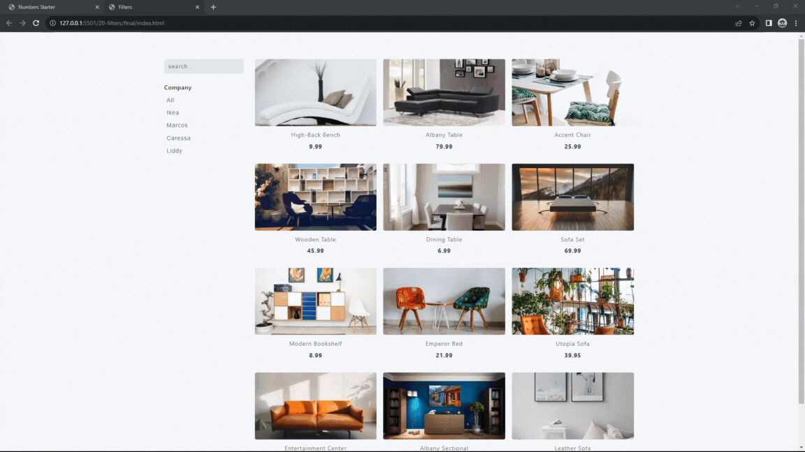

#### 293. [Filters - Intro](#293)

#### 294. [Filters - HTML Structure](#294)

#### 295. [Filters - Display Products](#295)

#### 296. [Filters - Text Filter](#296)

#### 297. [Filters - Let and Original Array](#297)

#### 298. [Filters - Empty Array](#298)

#### 299. [Filters - Display Buttons](#299)

#### 300. [Filters - Buttons Filter](#300)

---

 

### 293. Filters - Intro

> **_Business Objective: Layout_**

| Technology    | Description   |
| ------------- | ------------- |
| `Language`    | html, css, js |
| `Framework`   | -             |
| `Library`     | -             |
| `Text editor` | Vs code       |

---

 

### 294. Filters - HTML Structure

 

### 295. Filters - Display Products

 

### 296. Filters - Text Filter

 

### 297. Filters - Let and Original Array

 

### 298. Filters - Empty Array

 

### 299. Filters - Display Buttons

 

### 300. Filters - Buttons Filter

 
