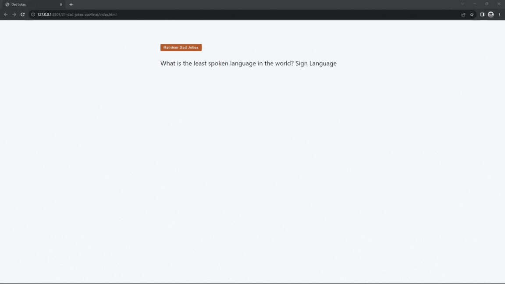

#### 329. [Dad Jokes - Intro](#329)

#### 330. [Dad Jokes - HTML Structure](#330)

#### 331. [API Fundamentals](#331)

#### 332. [Dad Jokes - Docs](#332)

#### 333. [Dad Jokes - Select Elements](#333)

#### 334. [Dad Jokes - Fetch Random Joke](#334)

#### 335. [Dad Jokes - Loading](#335)

#### 336. [Dad Jokes - Try / Catch](#336)

#### 337. [Dad Jokes - Throw New Error](#337)

---

 

### 329. Dad Jokes - Intro

> **_Business Objective: Layout_**

| Technology    | Description   |
| ------------- | ------------- |
| `Language`    | html, css, js |
| `Framework`   | -             |
| `Library`     | -             |
| `Text editor` | Vs code       |

---

 

### 330. Dad Jokes - HTML Structure

 

### 331. API Fundamentals

 

### 332. Dad Jokes - Docs

 

### 333. Dad Jokes - Select Elements

 

### 334. Dad Jokes - Fetch Random Joke

 

### 335. Dad Jokes - Loading

 

### 336. Dad Jokes - Try / Catch

 

### 337. Dad Jokes - Throw New Error

 
