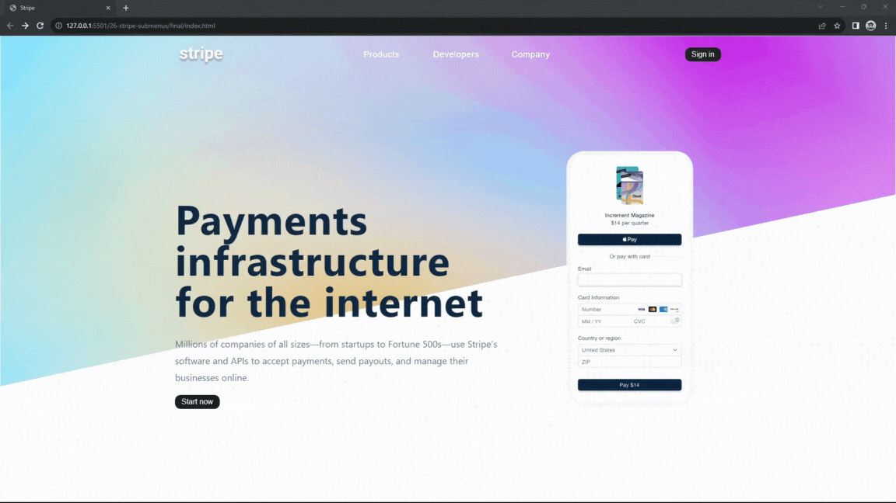

#### 380. [Intro](#380)

#### 381. [Starter Project](#381)

#### 382. [HTML](#382)

#### 383. [Sidebar Toggle](#383)

#### 384. [Sidebar Complete](#384)

#### 385. [Submenu Setup](#385)

#### 386. [Submenu Links](#386)

#### 387. [Submenu - Hide and Column Layout](#387)

---

 

### 380. Intro

> **_Business Objective: Layout_**

| Technology    | Description   |
| ------------- | ------------- |
| `Language`    | html, css, js |
| `Framework`   | -             |
| `Library`     | -             |
| `Text editor` | Vs code       |

---

 

### 381. Starter Project

 

### 382. HTML

 

### 383. Sidebar Toggle

 

### 384. Sidebar Complete

 

### 385. Submenu Setup

 

### 386. Submenu Links

 

### 387. Submenu - Hide and Column Layout

 
