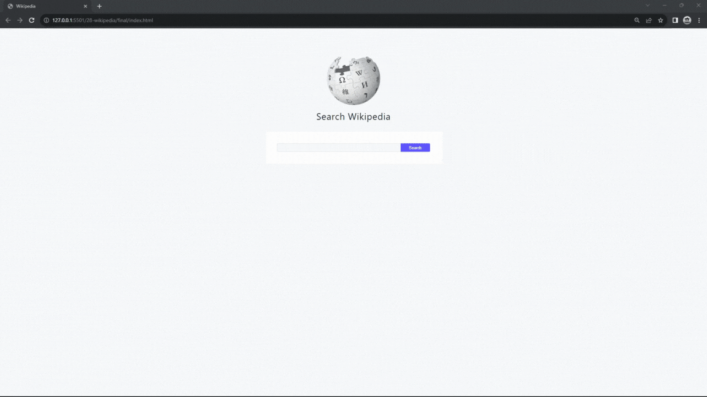

#### 396. [Intro](#396)

#### 397. [HTML Structure](#397)

#### 398. [API Docs](#398)

#### 399. [Initial Setup](#399)

#### 400. [Fetch Pages](#400)

#### 401. [Render Results](#401)

---

 

### 396. Intro

> **_Business Objective: Layout_**

| Technology    | Description   |
| ------------- | ------------- |
| `Language`    | html, css, js |
| `Framework`   | -             |
| `Library`     | -             |
| `Text editor` | Vs code       |

---

 

### 397. HTML Structure

 

### 398. API Docs

 

### 399. Initial Setup

 

### 400. Fetch Pages

 

### 401. Render Results

 
